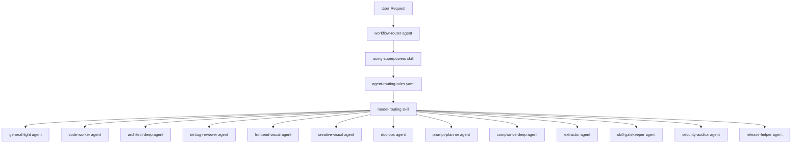

# Global Agent And Skill Relationship Map

Updated: 2026-07-06
Scope: global agent and skill topology derived from `C:\Users\105221\.codex\agents` and `C:\Users\105221\.codex\skills`
Purpose: global relationship reference for future sessions

## Role

This map explains the current global control plane:
- how requests enter the system
- which routing skills choose workflow and specialist ownership
- which custom agents execute the routed work
- which skill families map to which agent families

## Source Of Truth

- Global agents: `C:\Users\105221\.codex\agents`
- Global skills: `C:\Users\105221\.codex\skills`
- Key routing files:
  - `using-superpowers/SKILL.md`
  - `using-superpowers/agent-routing-rules.yaml`
  - `using-superpowers/AGENT_ROUTER_PROMPT.md`
  - `using-superpowers/COMPRESSION_POLICY_ROUTING.md`
  - `using-superpowers/MCP_ROUTING_POLICY.md`
  - `model-routing/SKILL.md`
  - `workflow-router.toml`

## Topology

## Control Plane

### 1. Entry and intent routing

- `workflow-router` is the top-level custom agent for task classification.
- `using-superpowers` is the first routing skill it relies on.
- `using-superpowers` decides:
  - fast-track vs full workflow
  - artifact type
  - domain signals
  - exactly one primary agent or workflow owner
  - optional support agents
  - compression policy
  - next workflow node

### 2. Workflow and model routing

- `model-routing` runs after `using-superpowers`.
- `model-routing` maps the chosen workflow family to one shared custom agent profile.
- The current routing pattern is:
  - classify first
  - choose the narrowest specialist when possible
  - otherwise choose a workflow skill
  - then map the skill family to a custom agent family

### 3. Governance gates

- `skill-gatekeeper` is mandatory before third-party skill or MCP install/enable decisions.
- `security-auditor` owns security work once scope and safe-testing boundaries are framed.
- `verification-before-completion` is the completion proof gate.
- `requesting-code-review` and `receiving-code-review` sit in the review lane, not in the execution lane.

## Agent Families

| Agent | Main role |
| --- | --- |
| `workflow-router` | top-level routing and workflow classification |
| `general-light` | tiny fast-track tasks and low-risk local work |
| `code-worker` | implementation, TDD, plan execution, worktrees |
| `architect-deep` | architecture, decomposition, multi-agent design, OSS scouting |
| `debug-reviewer` | debugging, verification, review, regression analysis |
| `frontend-visual` | frontend implementation and visual QA |
| `creative-visual` | image generation planning and visual concept work |
| `doc-ops` | documents, spreadsheets, slides, PDFs |
| `prompt-planner` | prompts, docs, plans, brainstorming, skill/plugin authoring |
| `compliance-deep` | compliance and regulation comparison |
| `extractor` | email and thread extraction |
| `skill-gatekeeper` | extension trust and intake review |
| `security-auditor` | security audit and exploitability review |
| `release-helper` | branch finishing and release wrap-up |

## Skill To Agent Mapping

### Router and routing support

- `using-superpowers` -> `workflow-router`
- `model-routing` -> `workflow-router`

### Fast-track and basic execution

- tiny fast-track work -> `general-light`
- `test-driven-development` -> `code-worker`
- `executing-plans` -> `code-worker`
- `using-git-worktrees` -> `code-worker`

### Architecture and orchestration

- `multi-agent-systems-architect` -> `architect-deep`
- `subagent-driven-development` -> `architect-deep`
- `dispatching-parallel-agents` -> `architect-deep`
- `oss-solution-scout` -> `architect-deep`

### Debug, review, verification

- `systematic-debugging` -> `debug-reviewer`
- `verification-before-completion` -> `debug-reviewer`
- `requesting-code-review` -> `debug-reviewer`
- `receiving-code-review` -> `debug-reviewer`

### Frontend and design

- `design-taste-frontend` -> `frontend-visual`
- `redesign-existing-projects` -> `frontend-visual`
- `web-design-polish` -> `frontend-visual`
- `visual-qa` -> `frontend-visual`
- `image-to-code` -> `frontend-visual`
- `ui-ux-pro-max` -> `frontend-visual`
- `brandkit` -> `creative-visual`

### Documents and planning

- document and spreadsheet work -> `doc-ops`
- `prompt-engineer` -> `prompt-planner`
- `writing-skills` -> `prompt-planner`
- `writing-plans` -> `prompt-planner`
- `brainstorming` -> `prompt-planner`

### Specialists and gates

- `email-intelligence-engineer` -> `extractor`
- compliance work -> `compliance-deep`
- third-party intake and install trust -> `skill-gatekeeper`
- security audit and exploitability -> `security-auditor`
- `finishing-a-development-branch` -> `release-helper`

## Practical Read Order For Future Sessions

When a future session needs to rebuild understanding quickly, use this order:

1. Read `global-agent-skill-relationship-map.md`
2. Read `C:\Users\105221\.codex\agents\workflow-router.toml`
3. Read `C:\Users\105221\.codex\skills\using-superpowers\SKILL.md`
4. Read `C:\Users\105221\.codex\skills\using-superpowers\agent-routing-rules.yaml`
5. Read `C:\Users\105221\.codex\skills\model-routing\SKILL.md`

## Refresh Trigger

Refresh this map when any of these change:
- a new file is added under `C:\Users\105221\.codex\agents`
- a new top-level skill is added under `C:\Users\105221\.codex\skills`
- `using-superpowers` routing files change
- `model-routing/SKILL.md` changes
- a custom agent changes role or model tier
